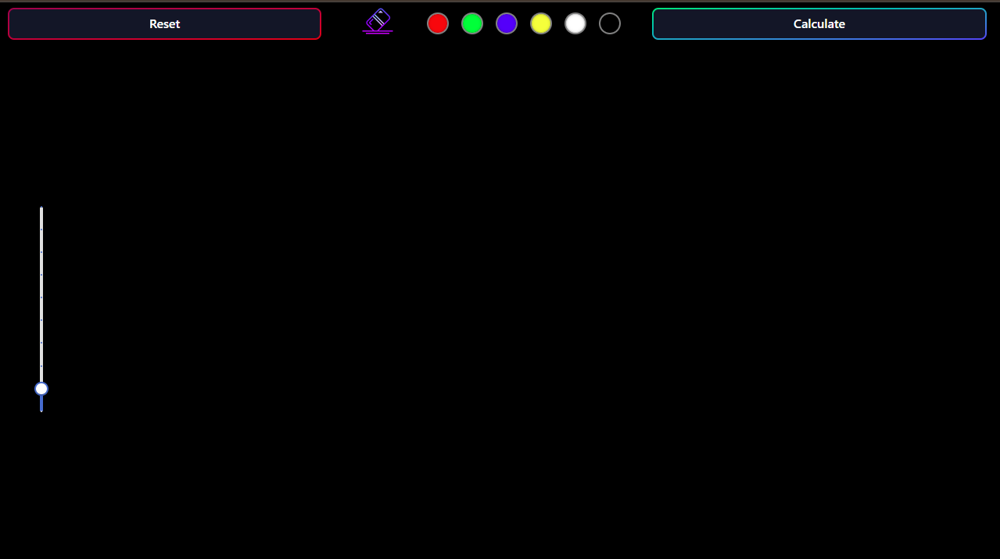
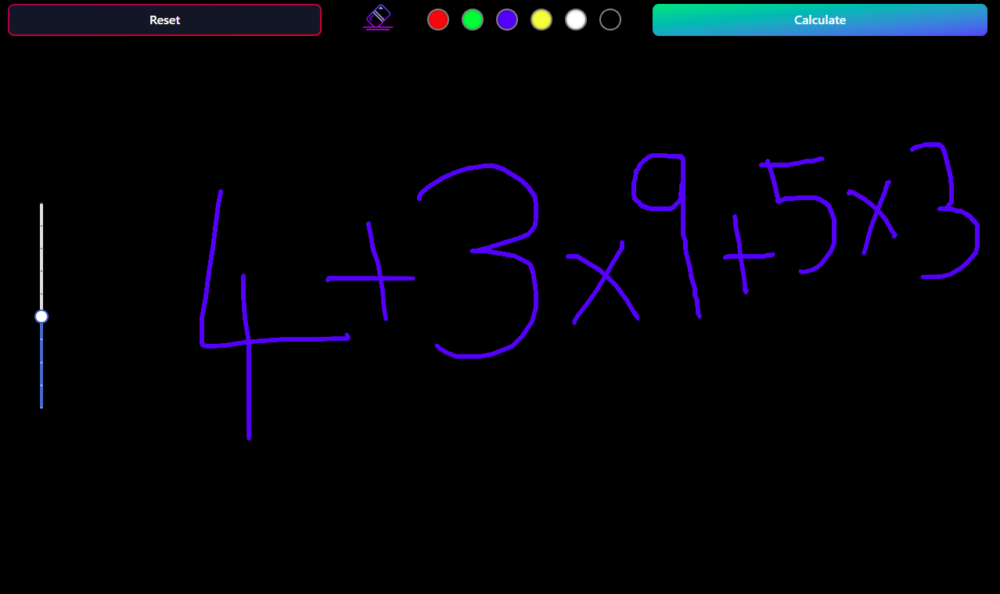

# ✨ Mathify-AI

Mathify-AI is an intelligent **handwritten math problem solver** that lets users draw equations on a digital canvas.  
The drawing is processed and sent to the backend, where an AI model interprets the problem and returns the solution in **LaTeX** format, beautifully rendered with **MathJax**.

This project was built as part of an academic submission and demonstrates the fusion of **AI, React, and backend APIs** to solve real-world mathematical problems.

---

## 🚀 Features
- ✍️ **Canvas Drawing** – Write math problems by hand directly on the app.  
- 🤖 **AI-Powered Solver** – Problems are interpreted and solved using an AI API.  
- 🔢 **LaTeX Rendering** – Clean math formatting using **MathJax**.  
- 🌓 **Dark Mode** – Seamless theme toggle for better user experience.  
- 📱 **Responsive Design** – Works smoothly on desktop and mobile.  
- 🧮 **Step-by-Step Approach** *(optional future enhancement)*.

---

## 🛠️ Tech Stack
- **Frontend:** React, Vite, Tailwind CSS, MathJax  
- **Backend:** Node.js, Express  
- **AI API:** Google Gemini API (via `@google/genai`)  
- **Other:** GSAP animations, Shadcn UI components  

---

## 📂 Project Structure
```
Mathify-Ai/
│
├── Backend/          # Express backend for AI API calls
├── public/           # Static assets
├── src/              # React frontend source
│   ├── components/   # UI components
│   ├── assets/       # Icons, brush colors, etc.
│   └── App.jsx       # Main app
│
├── package.json      # Dependencies & scripts
├── vite.config.js    # Vite configuration
└── README.md
```

---

## ⚙️ Installation & Usage

1. **Clone the repository**
   ```bash
   git clone https://github.com/Kushalkush-dev/Mathify-Ai.git
   cd Mathify-Ai
   ```

2. **Install dependencies**
   ```bash
   npm install
   ```

3. **Set up environment variables**  
   Create a `.env` file in both `Backend/` and root if needed:
   ```
   GEMINI_API_KEY=your_api_key_here
   ```

4. **Run the backend**
   ```bash
   cd Backend
   npm install
   node index.js
   ```

5. **Run the frontend**
   ```bash
   cd ..
   npm run dev
   ```

6. Open in browser:  
   ```
   http://localhost:5173
   ```

---

## 🎥 Demo / Screenshots

Example:  



---

## 🤝 Contributing
Contributions are welcome!  
- Fork the repo  
- Create a new branch (`feature/your-feature`)  
- Commit your changes  
- Push and open a Pull Request  

---

## 📜 License
This project is licensed under the **MIT License** – feel free to use and modify it.  

---

## 👨‍💻 Author
- **Kushal Kush** – [GitHub](https://github.com/Kushalkush-dev)

